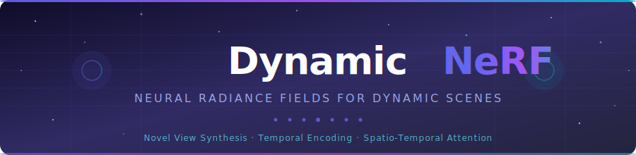
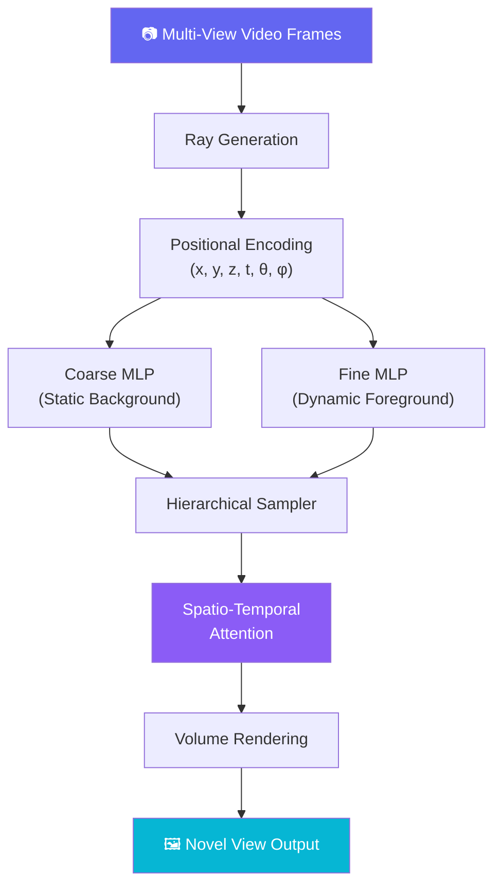

<div align="center">
  
</div>

<div align="center">


**Novel view synthesis for dynamic 3D scenes — rendered with neural magic.**

[🚀 Quick Start](#-installation) · [📖 Usage](#-usage) · [📊 Results](#-results) · [🗺️ Roadmap](#️-roadmap)

</div>

---

## 🔄 What is Dynamic-NeRF?

**Dynamic-NeRF** extends the landmark Neural Radiance Fields technique to handle *time* — capturing moving objects, shifting lighting, and real-world scene dynamics. Where traditional NeRF freezes the world, Dynamic-NeRF lets it breathe.

> Reconstruct and render any dynamic 3D scene from multi-view video at any viewpoint, at any moment in time.

---

## ✨ Key Features

<div align="center">

| 🕐 Temporal Encoding | 🎯 Spatio-Temporal Attention | 🎬 Static-Dynamic Decomposition |
|:---:|:---:|:---:|
| Models time as a first-class dimension — every frame is a new slice of the 4D world | Intelligent attention mechanisms that zero-in on what's actually moving | Clean separation of static backgrounds from dynamic foreground objects |

| 🖼️ Novel View Synthesis | 🔁 Temporal Consistency | ⚡ Efficient Ray Sampling |
|:---:|:---:|:---:|
| Generate photo-realistic viewpoints at arbitrary space-time coordinates | Silky-smooth interpolation between time steps — no flickering | Optimized coarse-to-fine sampling for fast, high-quality rendering |

</div>

---

## 🧩 Architecture

The model stacks a time-conditioned MLP, Fourier positional encoding, and a spatio-temporal attention module into a hierarchical coarse-to-fine rendering pipeline.



**Core components:**
- **Time-Conditioned MLP** — network conditioned on `(x, y, z, θ, φ, t)` jointly
- **Temporal Embedding** — Fourier feature encoding specialized for time
- **Spatio-Temporal Attention** — dynamic region weighting across space and time
- **Hierarchical Sampling** — coarse pass informs fine-grained ray marching

---

## 📊 Datasets

Supports three data modalities out of the box:

- 🧪 **D-NeRF Dataset** — synthetic sequences with controlled object motion and ground-truth cameras
- 🎨 **Custom Blender Sequences** — rendered scenes with full camera parameter access
- 🌍 **Real-World Multi-View Video** — captured footage of dynamic, uncontrolled scenes

> See [`src/scripts/preprocess_data.py`](src/scripts/preprocess_data.py) for preprocessing utilities.

---

## 🔧 Installation

```bash
# 1. Clone the repository
git clone https://github.com/1Utkarsh1/dynamic-nerf.git
cd dynamic-nerf

# 2. Create and activate a virtual environment
python -m venv venv
source venv/bin/activate       # Windows: venv\Scripts\activate

# 3. Install as an editable package (recommended)
pip install -e .

# — or — install dependencies directly
pip install -r requirements.txt
```

---

## 📈 Usage

### Data Preprocessing

```bash
# Blender synthetic dataset
python -m src.scripts.preprocess_data \
  --input_dir /path/to/blender/data \
  --output_dir data/processed/blender_dataset \
  --dataset_type blender

# Video input (with custom FPS)
python -m src.scripts.preprocess_data \
  --input_dir /path/to/video.mp4 \
  --output_dir data/processed/video_dataset \
  --dataset_type custom_video \
  --fps 24
```

### Training

```bash
# Default config
python -m src.train \
  --config configs/default.yaml \
  --data_path data/processed/dataset \
  --output_dir checkpoints/experiment1

# Custom hyperparameters
python -m src.train \
  --config configs/default.yaml \
  --data_path data/processed/dataset \
  --output_dir checkpoints/experiment2 \
  --batch_size 2048 \
  --learning_rate 1e-4 \
  --num_iterations 300000
```

### Rendering

```bash
# Render novel views
python -m src.render \
  --config configs/default.yaml \
  --checkpoint checkpoints/experiment1/model_200000.pt \
  --output_dir results/novel_views

# Render a time-varying video
python -m src.render \
  --config configs/default.yaml \
  --checkpoint checkpoints/experiment1/model_200000.pt \
  --output_dir results/video \
  --render_video \
  --time_range 0 1 60
```

### Experiments & Notebooks

```bash
# Launch Jupyter for interactive exploration
jupyter notebook experiments/
```

---

## 📁 Project Structure

```
dynamic-nerf/
├── src/
│   ├── models/
│   │   ├── nerf.py             # Static NeRF baseline
│   │   └── dynamic_nerf.py     # Dynamic NeRF (main model)
│   ├── data/
│   │   └── dataset.py          # Dataset classes & loaders
│   ├── utils/
│   │   ├── ray_utils.py        # Ray generation & sampling
│   │   ├── config.py           # Config management
│   │   └── visualization.py    # Visualization helpers
│   ├── scripts/
│   │   └── preprocess_data.py  # Data preprocessing
│   ├── train.py                # Training entrypoint
│   └── render.py               # Rendering entrypoint
├── experiments/                # Jupyter notebooks
├── configs/
│   └── default.yaml            # Default configuration
├── data/                       # Dataset storage
├── docs/                       # Documentation & images
└── results/                    # Saved renders & visualizations
```

---

## 📊 Results

Performance benchmarks on the **D-NeRF dataset** — higher PSNR/SSIM and lower LPIPS is better:

| Scene | PSNR ↑ | SSIM ↑ | LPIPS ↓ | Training Time |
|:------|:------:|:------:|:-------:|:-------------:|
| 🟩 Lego | **32.8** | **0.961** | **0.042** | 8.5 hrs |
| 🔴 Bouncing Balls | 30.2 | 0.942 | 0.063 | 7.2 hrs |
| 🦕 T-Rex | 29.7 | 0.937 | 0.072 | 9.1 hrs |
| 🧬 Mutant | 31.5 | 0.953 | 0.047 | 8.3 hrs |
| 🪝 Hook | 30.9 | 0.948 | 0.055 | 7.8 hrs |

---

## 🗺️ Roadmap

- [x] Repository structure & project setup
- [x] Baseline static NeRF implementation
- [x] Dynamic extension with temporal encoding
- [x] Spatio-temporal attention mechanisms
- [x] Temporal embedding experimentation
- [x] Data preprocessing pipeline
- [x] Training & rendering pipeline
- [x] Documentation & result visualization
- [ ] Pre-trained model zoo
- [ ] Interactive demo application
- [ ] Advanced optimization techniques
- [ ] Mobile / web deployment

---

## 🤝 Contributing

Contributions are warmly welcome! Here's how to get started:

1. **Fork** the repository
2. **Create** your feature branch: `git checkout -b feature/amazing-feature`
3. **Commit** your changes: `git commit -m 'Add some amazing feature'`
4. **Push** to the branch: `git push origin feature/amazing-feature`
5. **Open** a Pull Request

---

## 📚 References

<details>
<summary>Click to expand references</summary>

1. Mildenhall, B. et al. — *"NeRF: Representing Scenes as Neural Radiance Fields for View Synthesis"* — ECCV (2020)
2. Pumarola, A. et al. — *"D-NeRF: Neural Radiance Fields for Dynamic Scenes"* — CVPR (2021)
3. Li, Z. et al. — *"Neural Scene Flow Fields for Space-Time View Synthesis of Dynamic Scenes"* — CVPR (2021)
4. Park, K. et al. — *"Nerfies: Deformable Neural Radiance Fields"* — ICCV (2021)
5. Xian, W. et al. — *"Space-time Neural Irradiance Fields for Free-Viewpoint Video"* — CVPR (2021)
6. Du, Y. et al. — *"Neural Radiance Flow for 4D View Synthesis and Video Processing"* — ICCV (2021)

</details>

---

## 📄 License

Distributed under the **MIT License**. See [`LICENSE`](LICENSE) for details.

---

<div align="center">

Made with ❤️ by [Utkarsh Rajput](https://github.com/1Utkarsh1)

<br/>


</div>
